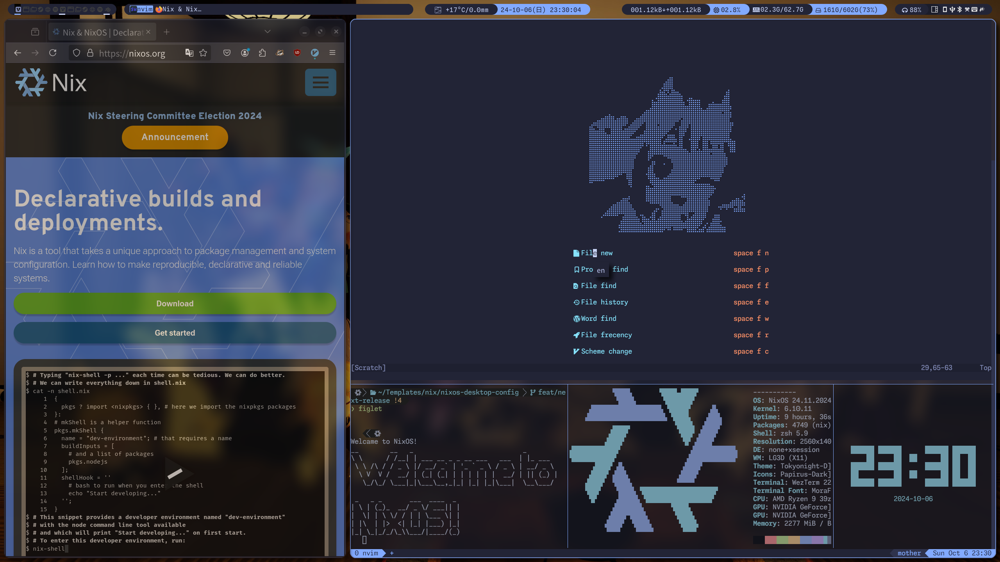

# お前は誰だ？

## プロフィール

:::::::::::::: {.columns}
::: {.column width="65%" }

| 名前 | <font color="cyan">Sumi-Sumi</font> |
| :--- | :---------------------------------- |
| 身分 | 院生 (M2→D1, 音声合成系)            |
| nix  | 2022/09〜                           |
| 用途 | Desktop, HomeLab, ML                |

:::::::::::::: {.columns}
::: {.column width="50%" }
<a href="https://github.com/misumisumi/nixos-desktop-config"><font size="6pt">nixos-desktop-config</font></a>
{width=60%}
:::

::: {.column width="50%" }
<a href="https://github.com/misumisumi/nvimdots"><font size="8pt">nvimdots</font></a>
{width=60%}
:::
::::::::::::::

:::
::: {.column width="35%"}

:::
::::::::::::::

## Linuxの変遷

```plantuml
!include https://raw.githubusercontent.com/patrik-csak/one-dark-plantuml-theme/v1.0.1/theme.puml
skinparam sequenceArrowThickness 6

object "" as l1
object "" as l2
object "" as l3

l1 : 
l2 : 
l3 : 

l1 -> l2
l2 -> l3
```

## デスクトップ環境

:::::::::::::: {.columns}
::: {.column width="60%"}

| NixOS    |     unstable     |
| :------- | :--------------: |
| WM       |      Qtile       |
| Shell    |       Zsh        |
| Terminal | Wezterm<br>+Tmux |
| Editor   |      Neovim      |

:::

::: {.column width="70%"}

:::
::::::::::::::

# 妥協しない？

## 妥協しない？

1. nixos-unstableの安定的な運用
2. プラットフォーム間で環境差異が無いこと
3. **宣言的デプロイ** is All You Need

## Tips的な

1. **リポジトリ戦略**：GitHub flow, CI/CD
2. <u>外部パッケージマネージャ</u>の統合
3. **chezmoi**の統合

# リポジトリ戦略

## GitHub flow


- 細かい変更が多々ある

## 常にロールバックできる?

**No** (force pull/push...)

- NixOSにおいて**コード=マシン状態** (IaC)
- 適切な管理下でロールバックが初めて担保
  - mainは常に<u>起動可能</u>な**最新**の状態を維持

→ 問題無く動作する？

## バージョン戦略

- nixpkgs/modulesがアップストリームの仕様に<br>追随している訳ではない
- **バージョニング**で動作保証
  - mainにマージした時点でバージョンを上げる

:::::::::::::: {.columns}
::: {.column width="50%"}
{width=110%}
:::
::: {.column width="50%"}
{width=110%}
:::
::::::::::::::

## flake.lockの自動更新
