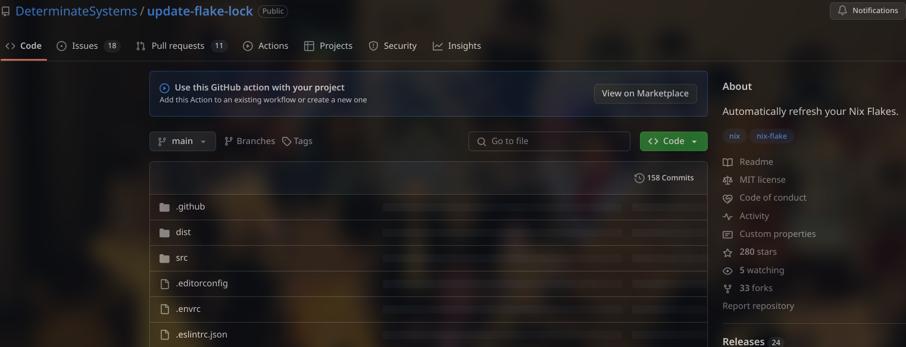
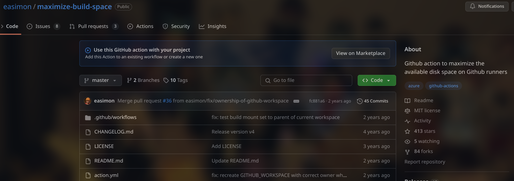
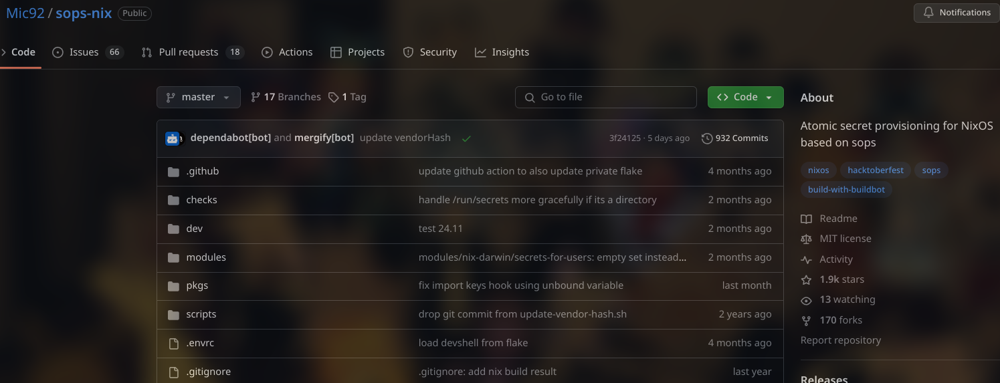
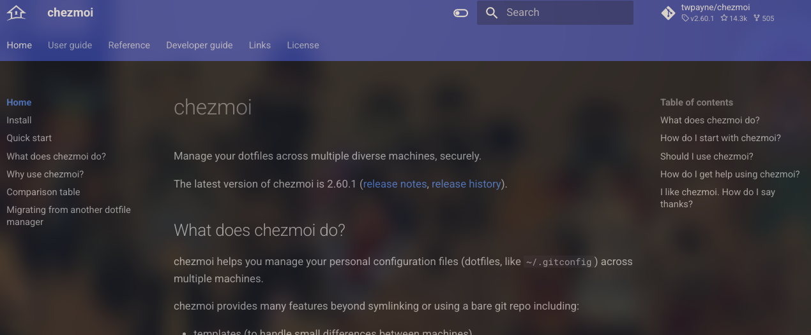
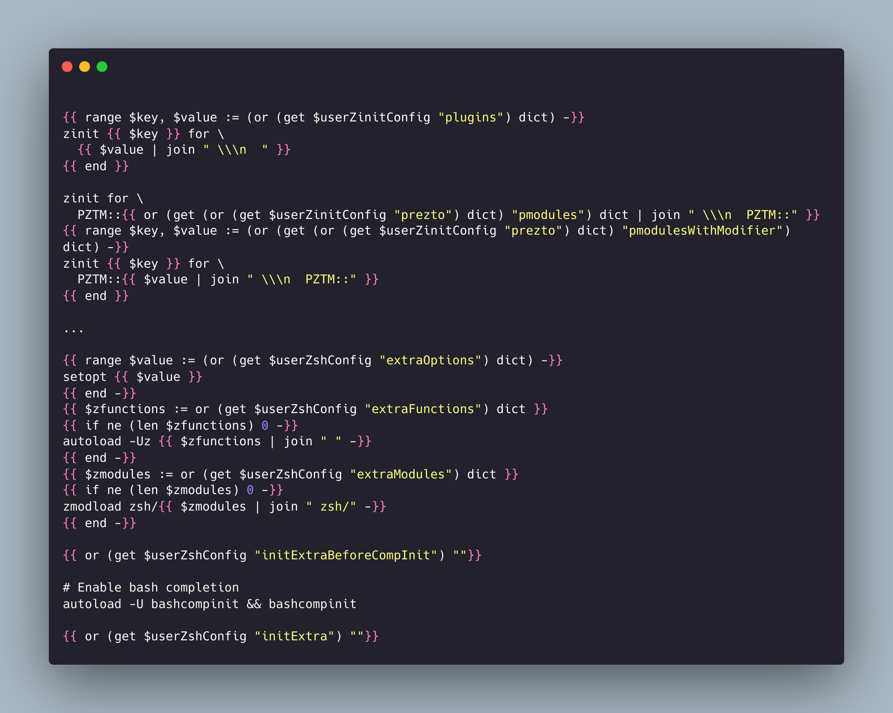

# お前は誰だ？

## プロフィール

:::::::::::::: {.columns}
::: {.column width="60%" }

| 名前 | <font color="cyan">Sumi-Sumi</font> |
| :--- | :---------------------------------- |
| 身分 | 院生 (M2→D1, 音声合成系)            |
| nix  | 2022/09〜                           |
| 用途 | Desktop, HomeLab, ML                |

:::::::::::::: {.columns}
::: {.column width="33%" }
[今日の資料](https://drive.google.com/file/d/1roGWup39v-6MWu9Fu8PM-4zqlLHIJ14s/view?usp=drive_link)
{width=75%}
:::
::: {.column width="33%" }
<a href="https://github.com/misumisumi/nixos-desktop-config" style="font-size:24px">nixos-desktop-config</a>
{width=75%}
:::
::: {.column width="33%" }
[nvimdots](https://github.com/misumisumi/nvimdots)
{width=75%}
:::
::::::::::::::

:::
::: {.column width="40%"}
{width=75%}
:::
::::::::::::::

## ディストロの変遷

```plantuml
!include https://raw.githubusercontent.com/patrik-csak/one-dark-plantuml-theme/v1.0.1/theme.puml
skinparam sequenceArrowThickness 6

object "" as l1
object "" as l2
object "" as l3

l1 : 
l2 : 
l3 : 

l1 -> l2
l2 -> l3
```

## デスクトップ環境

:::::::::::::: {.columns align=center}
::: {.column width="40%"}
| NixOS | unstable |
| :------- | :--------------: |
| WM | Qtile |
| Shell | Zsh |
| Terminal | Wezterm<br>+Tmux |
| Editor | Neovim |

:::
::: {.column width="60%"}

:::
::::::::::::::

# とっても簡単なNixOS

## First Rise

- non flake
  1. `nixos-generate-config`
  2. `*.enable = true;`+頑張る
  3. `nixos-rebuild switch`
- flake
  1. `nix flake init`
  2. inputsに依存を追加
  - home-managerとかnixos-hardware...
  3. `*.enable = true;`+頑張る
  4. `nixos-rebuild switch`

→ NixOSの良さ活かせてる？

# 妥協しない？

---

1. <u>nixos-unstable</u>の安定的な運用
2. プラットフォーム間で環境差異が無いこと
3. **宣言的デプロイ** is All You Need

## どうやって実現する？

1. **CI/CD**による自動化
2. **Branch**・**Versioning**戦略
3. <u>外部パッケージマネージャ</u>の統合

# CI/CDによる自動化

## Arch Linux時代

- 適当なアプデ<br>→AURビルド不備、破壊的変更による起動不可
- `nix`=`Infrastructure as Code (IaC)`
  - CI/CDで予防できる！

## flake.lockの自動更新

- [DeterminateSystems/update-flake-lock](https://github.com/DeterminateSystems/update-flake-lock)
  - `flake.lock`を更新→PR作成
- 実際は依存先から順に更新
  - [nvimdots](https://github.com/misumisumi/nvimdots)→[flakes](https://github.com/misumisumi/flakes)→[nixos-desktop-config](https://github.com/misumisumi/flakes)

{width=60%}

## Deprecated optionの通知

- nixos-unstableは仕様変更が多々ある
- 式を評価<br>→`Evaluation Warning`があればISSUEを開く

{width=55%}

## ビルドテスト

- システムビルドに必要な容量：60GB～
- [標準Runner](https://docs.github.com/en/actions/writing-workflows/choosing-where-your-workflow-runs/choosing-the-runner-for-a-job#choosing-github-hosted-runners)は容量が足りない→空き29GB
- [easimon/maximize-build-space](https://github.com/easimon/maximize-build-space)
  - 不要パッケージの削除, ディスク(LVM)割り当ての変更
  - `/nix`：96GB確保
- ビルド時間：40分～

{width=55%}

## パブリックでのシークレット管理

- パブリックリポジトリだと標準Runnerが無料！
- 個人マシンには秘匿情報がいっぱい！
  - パスワード、ssh、APIキー...

## [Mic92/sops-nix](https://github.com/Mic92/sops-nix)

- **age**, **pgp**でファイル暗号化
- アクティベーション時に符号化
- `/nix/store`には暗号化ファイルが配置

{width=80%}

# Branch・Versioning戦略

## そのNixOS<br>常にロールバックできる?

<p style="font-size:96px">No</p>

- 既デプロイへのロールバック○
- コードレベルは？
  - force push/pull ...
- NixOSにおいて**コード=マシン状態** (IaC)
- 適切な管理下でロールバックが初めて担保

## ブランチ戦略：GitHub flow


- 細かい変更を受容
- mainは常に<u>起動可能</u>な状態を維持
  - →エラー無く動作する？

## バージョン戦略

- 起動可≠各Appがエラー無く動作
- nixpkgs/modulesが<br><u>アップストリームの仕様に追随している訳ではない</u>
- **リリース地点=動作確約**
  - ビルドテスト→mainにマージ→リリース<br>(テストは特定のファイルの変更があったときのみ)

:::::::::::::: {.columns}
::: {.column width="50%"}
{width=110%}
:::
::: {.column width="50%"}
{width=110%}
:::
::::::::::::::

## お一人様向け：より厳密な運用

- [reviewdog](https://github.com/reviewdog/reviewdog)によるコードレビュー
- 自分のコードに対して承認できない
  - github actions [bot] はworkflowが走らない
- **GitHub Apps**で別人格を作成
  - <u>agent-of-me</u>：<br>コードレビュー、変更の承認・取り消し
  - <u>workflow-executer</u>：<br>flake.lockの更新・リリースPRの作成

# 外部パッケージマネージャの統合

## nixは完全無欠で究極のpkg manager...<br>じゃない？

:::::::::::::: {.columns}
::: {.column width="60%"}

- 導入に<u>root権限</u>が必須
- 多くの容量
- 複数マシンでの`/nix/store`の共有
- 維持コスト
  - 上流の変更への追随
  - 教育・継承

= 共有鯖・支給PCで使いにくい  
→nixだけで完結させるのは限界

:::
::: {.column width="40%"}
{width=150%}
:::
::::::::::::::

## nixos-desktop-configの構成

- `App Conf`はnixpkgsを優先しているものもある


## [folke/lazy.nvim](https://github.com/folke/lazy.nvim)の統合

- `lazy-loadingによる高速起動` (～80ms)
- マルチプラットフォーム


## NixOS特有の設定

- NixOS上でのバイナリ動作
  - [nix-ld](https://github.com/nix-community/nix-ld)+依存関係をPATHへ追加
- *lock file*をnix上で扱うロジックの構築
  - `xdg.configFile`は<u>read only</u>なため

```plantuml
skinparam activityDiamondFontSize 36
skinparam ActivityFontSize 36
skinparam ArrowFontSize 36

start
:symlink <b>lazy-lock.lock.json</b> to <b>${NVIM_HOME}/lazy-lock.fixed.json</b>;
  if (exist <b>${NVIM_HOME}/lazy-lock.fixed.json</b>) then (yes)
    :merge <b>lazy-lock.fixed.json</b> to <b>lazy-lock.json</b>;
  else (no)
    :cp <b>lazy-lock.fixed.json</b> to <b>lazy-lock.json</b>;
  endif
end
```

(例): `mason-lock.json`

## [chezmoi](https://www.chezmoi.io)

- <u>windows</u>を含めたマルチプラットフォームに対応
- GPGやageを用いたファイル暗号化
- 各種パスワードマネージャのサポート
- アーカイブファイルの自動展開

{width=60%}

## 強力なテンプレートとスクリプト

:::::::::::::: {.columns}
::: {.column width="50%"}
<br>

- Goテンプレートによる動的な変更
- アクティベート時のスクリプト実行による追加処理
  - 非NixOS(**windows含む**)でも<br>宣言的パッケージインストール

:::
::: {.column width="50%"}
{width=85%}
:::
::::::::::::::

## chezmoiとnix

- chezmoi: [.chezmoidata.$FORMAT](https://www.chezmoi.io/reference/special-files/chezmoidata-format/)による状態管理
  - `json`、`toml`はnixの*builtins*で読み込み可
- nix: [xdg.configFile.source](https://home-manager-options.extranix.com/?query=xdg.configFile&release=master)で<br>設定ファイルを`$XDG_CONFIG_HOME`以下に配置

→設定ファイルを重複させなくて良い  
(<u>NixOS上でchezmoiは使っていない</u>)

**chezmoi環境の<u>再現性は担保されない</u>**

## 99%の再現性と1%の非再現性

- 再現性<利便性
- ex) zinit
  - 遅延ロード (3ms～5ms)
  - zshプラグインはバージョニングに厳密でない
    - nixpkgsは古いままのが多々ある
- ex) tpm
  - 非nix環境で

# まとめ

---

- リポジトリの運用次第で**より堅牢な**環境構築
- 外部パッケージの許容により**利便性を向上**
- chezmoiにより**windowsも**宣言的に管理

## 今後

:::::::::::::: {.columns}
::: {.column width="60%"}

- dotfilesはまだまだ続くよどこまでも
  - btrfs, nix-darwin, arm...
- テストの充実
  - VMを用いた起動テスト
- HomeLabの構築

<p style="font-size:88px">dotfilesは進捗じゃ<br>ありません！</p>
:::
::: {.column width="40%"}
{width=160%}
:::
::::::::::::::
