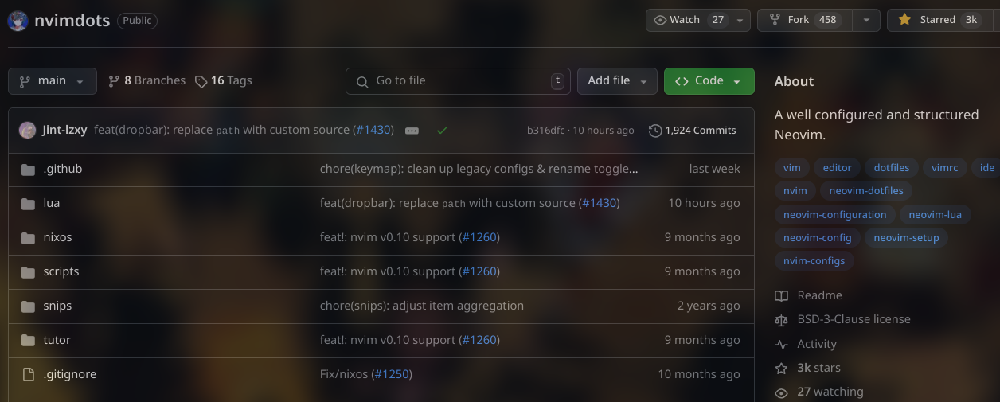

# お前は誰だ？

## プロフィール

:::::::::::::: {.columns}
::: {.column width="65%" }

| 名前 | <font color="magenta">Sumi-Sumi</font> |
| :--- | :------------------------------------- |
| 身分 | しがない院生 (音声合成系)              |
| nix  | 2022/09〜                              |
| 用途 | Desktop, HomeLab, ML                   |

:::::::::::::: {.columns}
::: {.column width="50%" }
<font size="6pt" color="cyan">nixos-desktop-config</font>
{width=60%}
:::

::: {.column width="50%" }
<font size="8pt" color="cyan">nvimdots</font>
{width=60%}
:::
::::::::::::::

:::
::: {.column width="35%"}

:::
::::::::::::::

## Linuxの変遷

```plantuml
!include https://raw.githubusercontent.com/patrik-csak/one-dark-plantuml-theme/v1.0.1/theme.puml
skinparam sequenceArrowThickness 6

object "" as l1
object "" as l2
object "" as l3

l1 : 
l2 : 
l3 : 

l1 -> l2
l2 -> l3
```

## デスクトップ環境

:::::::::::::: {.columns}
::: {.column width="60%"}

| NixOS    |     unstable     |
| :------- | :--------------: |
| WM       |      Qtile       |
| Shell    |       Zsh        |
| Terminal | Wezterm<br>+Tmux |
| Editor   |      Neovim      |

:::

::: {.column width="70%"}

:::
::::::::::::::

# 妥協しない？

## 妥協しない？

1. nixos-unstableの安定的な運用
2. プラットフォーム間で環境差異が無いこと
3. **Declarative deployments** is All You Need

## 達成したこと

1. GitHub flow + CI/CDによる自動テスト
2. 3. chezmoiの導入
