# お前は誰だ？

## プロフィール

:::::::::::::: {.columns}
::: {.column width="60%" }

| 名前     | Sumi-Sumi |
| :------- | :---------------------------------- |
| ぶいちゃ | メイド インフラ集会運営 etc...   |
| リアル   | 院生（音声合成系）                  |
| インフラ | HomeLab                             |

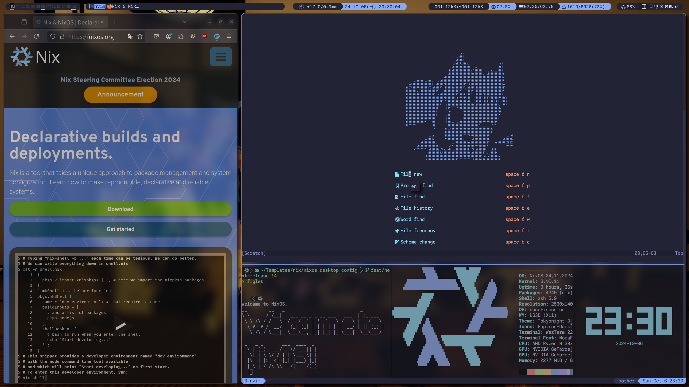{width=60%}

:::
::: {.column width="40%"}
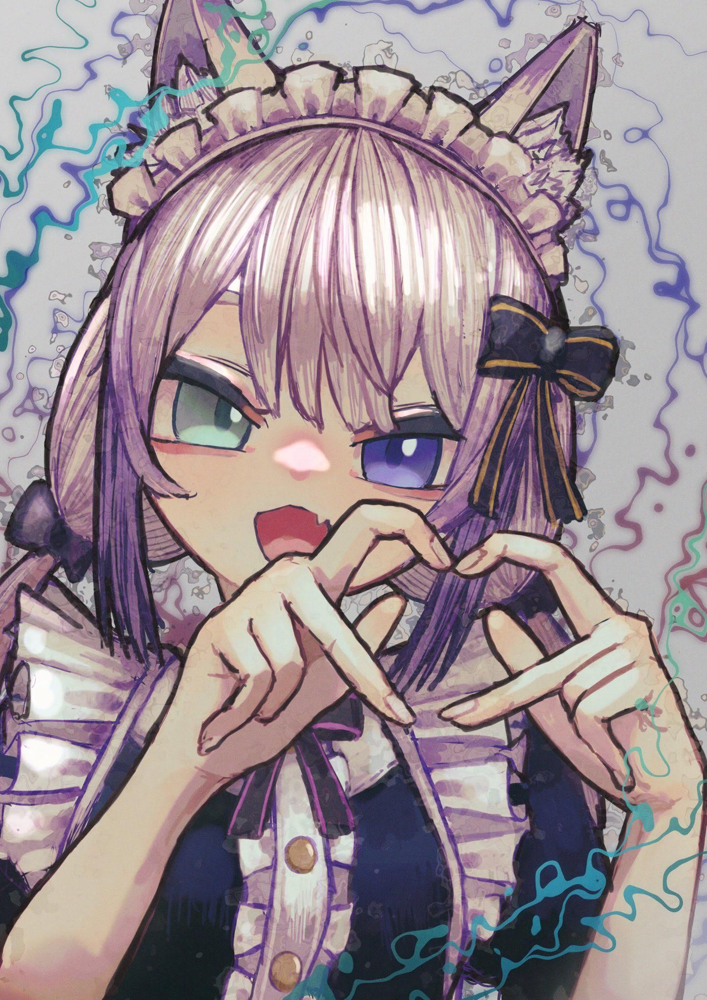{width=75%}
:::
::::::::::::::

## My HomeLab

- 当然のようにブレード鯖！
- InfiniBand、業務用AP (WiFi 6E)完備！
- まだ点火されていない！

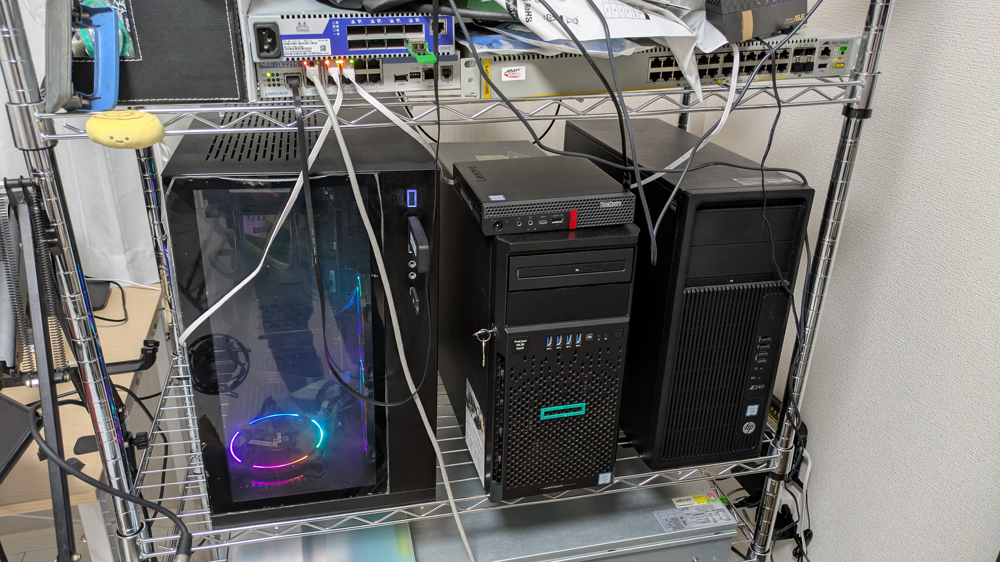{width=55%}

# これからのイベントと言えば！

## VKET REAL！

{width=80%}

---

もあるけれど...

<h1>お盆→帰省</h1>

::::::::::::::{.columns align=center}
::: {.column width="50%"}
{width=80%}
:::
::: {.column width="50%"}
{width=30%}  
{width=40%}
:::
::::::::::::::

## 帰省してもすること...無くない??

:::::::::::::: {.columns align=center}
::: {.column width="45%"}
 
 

:::
::: {.column width="10%"}
 
 
 
 

:::
::: {.column width="45%"}
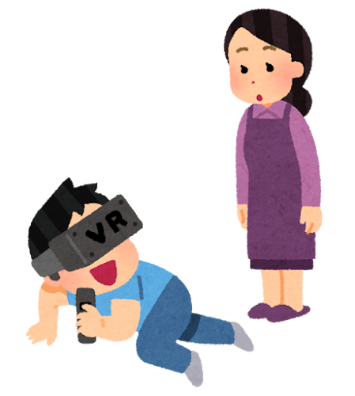

→ VRChatしよう！

:::
::::::::::::::

# フルトラをするという強い意思

---

フルトラは身体認識に影響を与える

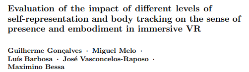
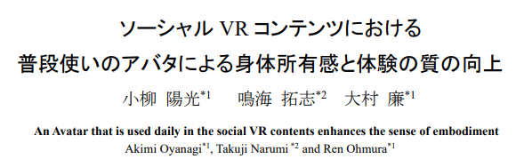

## 持ち物リスト

- ゲーミングノートPC
- HMD
- ベースステーション ×2
- トラッカ ×3～5

## ゲーミングノートPC

- お高い
- 割にデスクトップと比較すると性能が...
- とっても重い
- クソデカ充電器
  - 最早鈍器

→ できれば買いたくなーい

(HMD, フルトラ機材の重量には目を瞑る)

# オレオレVPNでどこでもフルトラVR

## {height=64pt style="margin:0pt"}でリモート接続は可能

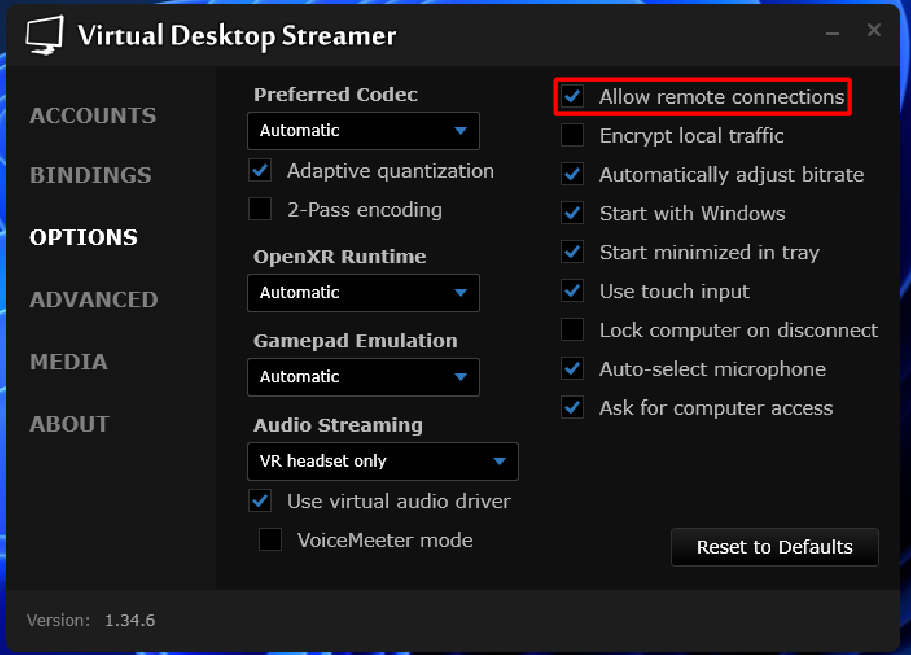{height=70%}

フルトラは×

---

ドングル=USB...

<u>USBでやりとりされるデータ</u>を ネットワークで送受信すればいいじゃん！

{width=30%}

## USB/IP [Hirofuchi+, 2005]

- Server: USBの共有元マシン
- Client: USBの共有先マシン
- <u>TCP/IP</u>で通信

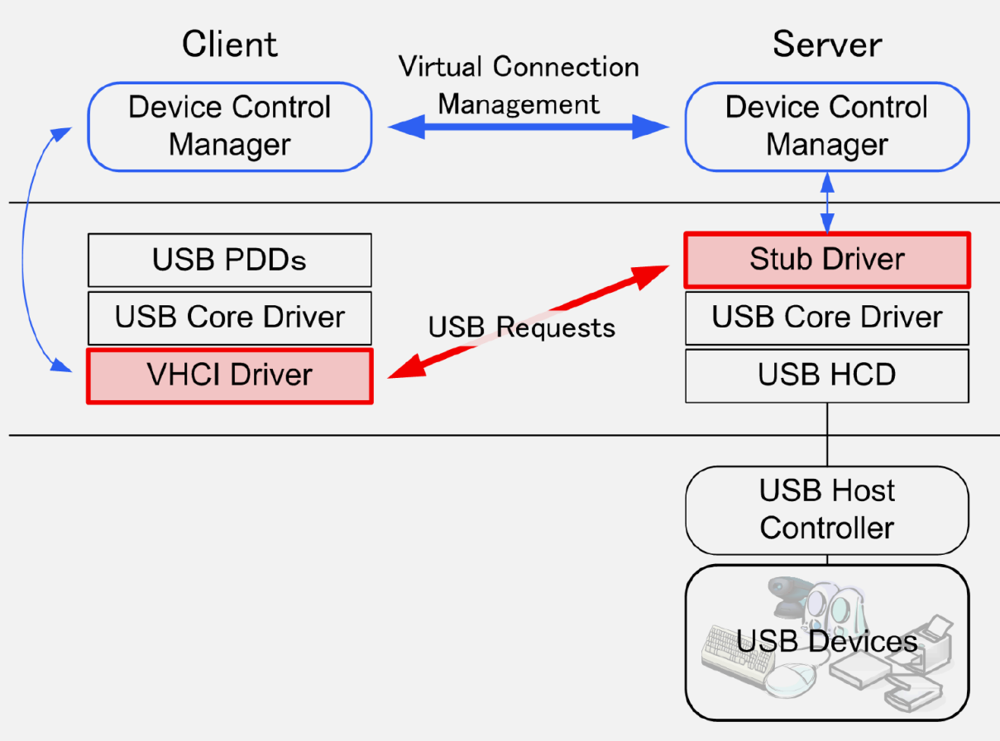{width=35%}

---

## USB/IP

- Linux kernelに統合済み(3.17～)
- macやwindows向けの実装もある
  - server/client: [jiegec/usbip](https://github.com/jiegec/usbip)
  - client: [vadimgrn/usbip-win2](https://github.com/vadimgrn/usbip-win2)

<!-- Sumi-SumiのフルトラもUSB over Network！ -->

SuperDongleはできない...っぽい

---

ここまでで、フルトラVRはできる

1. USB/IPとVirtualDesktopの設定
2. ポート開放
3. ルーティング設定
   - FW：特定ポート宛ての通信を接続先IPに転送
   - SSHのポート転送
4. 接続確認

**USB/IPは暗号化されていない**

---

おそらく...

父母兄妹・隣人はあなたのVR生活に興味津々！ 通信を傍受するだろう

:::::::::::::: {.columns align=center}
::: {.column width="50%"}
{width=70%}
:::
::: {.column width="50%"}
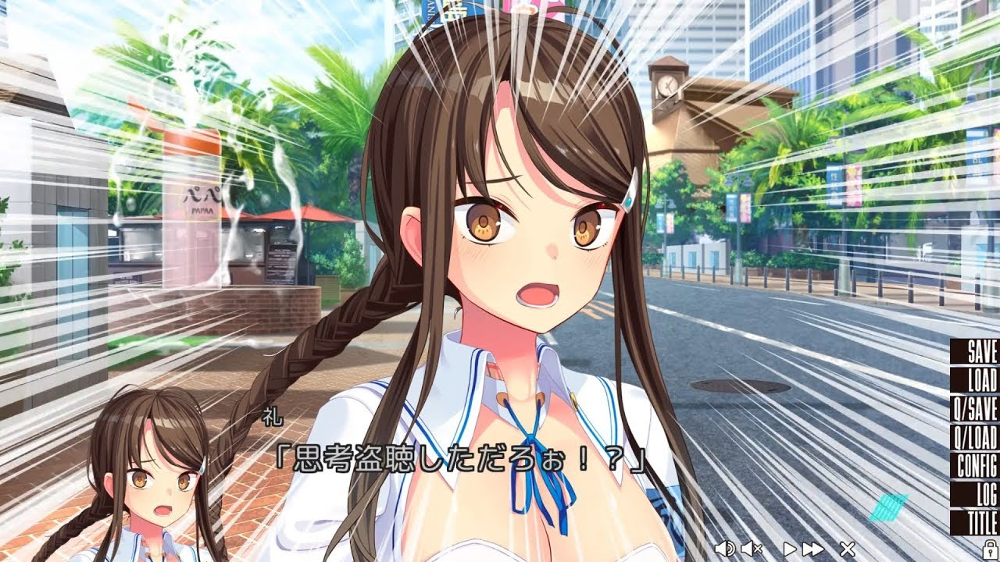{width=90%}
:::
::::::::::::::

<u>VirtualDesktopはend-to-endで暗号化</u>されています

---

というよりは...

- アプリ毎にルーターでポート開放するのが面倒
- クライアント(接続先)側で操作が必要
  - 場合によってはSSH接続が必要

## VPN: Virtual Private Network

- 拠点間を仮想的な専用線で繋げるやつ
  - 「社内ネットワークに繋ぐにはー」で使うやつ
- 遠隔地でも同一ネットワークにいるように見せられる
- ポート開放は<u>VPNで使うやつのみでOK</u>

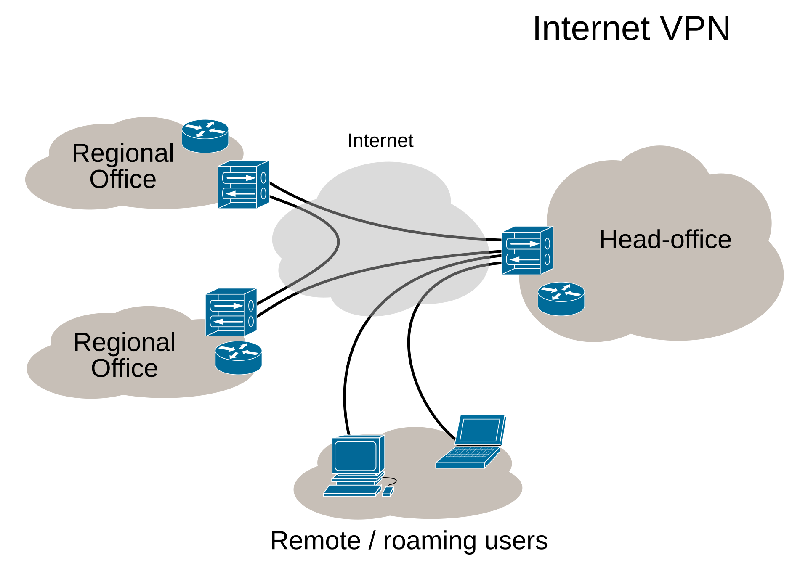{width=40% style="background-color:white;"}

---

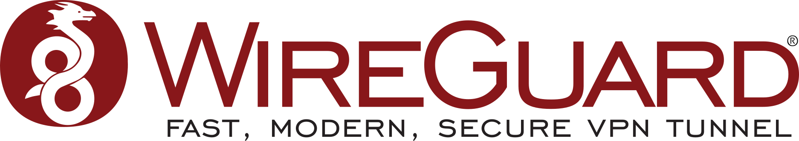{width=70% style="background-color:white;"}

- Linux Kernelに統合済(5.6～)
- マルチプラットフォーム
- 仕様が公開されている
  - <u>NDSS (セキュリティ分野のトップ会議)で採択済</u>
- 商用VPNでの採用実績もあり
  - ProtonVPN
  - TailscaleVPN

## 軽量かつ高速

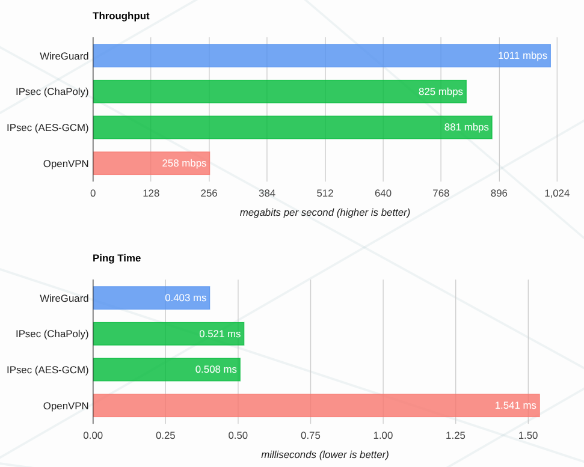{width=50%}

出典：https://www.wireguard.com/performance/

## シンプルな構築手順

1. 秘密鍵と公開鍵の作成
   - 事前共有鍵も設定可
2. WireGuard用の仮想ネットワークデバイス作成
3. FWの設定
   - ローカルネットワークに出るため必須
4. 接続

---

- 両拠点共に100mbpsあれば、快適なVRChatができる
  - フルトラは<u>やや追従にラグ有</u>
- HaritoraXやmocopiもできる...はず...
- USB/IP
  - mac/windowsを接続元にするのは未検証 (事例はネットにあり)
  - Linux on mac (m1)で転送は検証済
- WireGuard
  - 中古デスクトップで十分作成可

# この夏 VPN鯖からインフラ沼に飛び込もう！{.unlisted}
