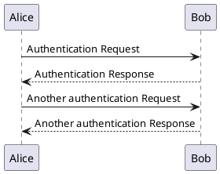

# 自鯖環境の紹介

---

{height=240px}

 SAO に登場するゲームバランスを司る自立型プログラム Cardinal System から拝借

- **High Available** 構成
  - kubernetes, DRBD
- 開発環境から物理・仮想マシンの設定・管理に至るまで全て **Infractracture as Code (IaC)** で構築

## 構成図

- 4 台の物理マシン + 1 台の管理マシン
  - 3 $\times$ ハイパーバイザー + 1 $\times$ 踏み台

