## テーマ

### 1. 窓を叩き割るところから始めたLinux

### 2. 院進で転学・転学科したはなし

自己紹介の後、どっちがいいか聞きます

## 自己紹介

:::::::::::::: {.columns}
::: {.column width="60%" }

|      |                                                   |
| ---- | ------------------------------------------------- |
| 名前 | `Sumi-Sumi`   (X: @SumiSumiVRC)                |
| 役割 | しがない(やつれた)大学院生                        |
| 専門 | 声質変換・音声合成                                |
| 最近 | NixOSでk8s建てたり 両性類声やったりDJしたり... |

:::
::: {.column width="40%"}

:::
::::::::::::::

## テーマ

### 1. 窓を叩き割るところから始めたLinux

### 2. 院進で転学・転学科したはなし

# 窓を叩き割るところから始めたLinux

## Linuxどうやって 使えるようになった？

これが分からない

- サーバーを構築したかったわけではない
- 「windowsよりLinuxの方が開発しやすいよ！」とどこかで見た
- 「機械学習するならLinuxだよ！」とやっぱりどこかで見た

## 斜に構えていたが 解決に時間を惜しまなかった

- 環境に不満が無いというときが無かった (今も)
- 「解決できそう！」だったら即やってみた

## 原始、開発環境はwindowsだった

- **Anaconda**がよく飛ぶ
- 突然出るブルースクリーン...
  - →再インスコバトルスタート
- そもそも機械学習するには非力なマシン
  - 2C4T, 8GBのラップトップ

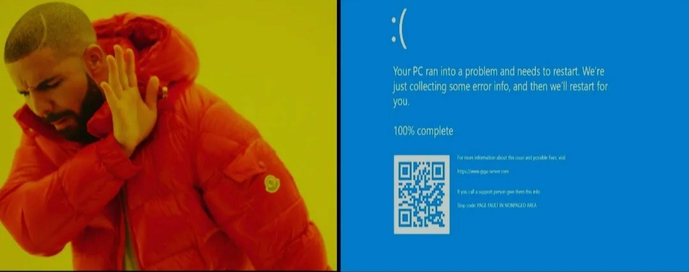{width=720px}

## Ubuntuをデュアルブートしよう

- `apt`って素晴らしい！
  - webを巡回しなくもソフトをインストールできるだと...!
- ちょっと重い...かも...?
  - ちょっと重い**Unity**が採用されていた16.04の時期だった

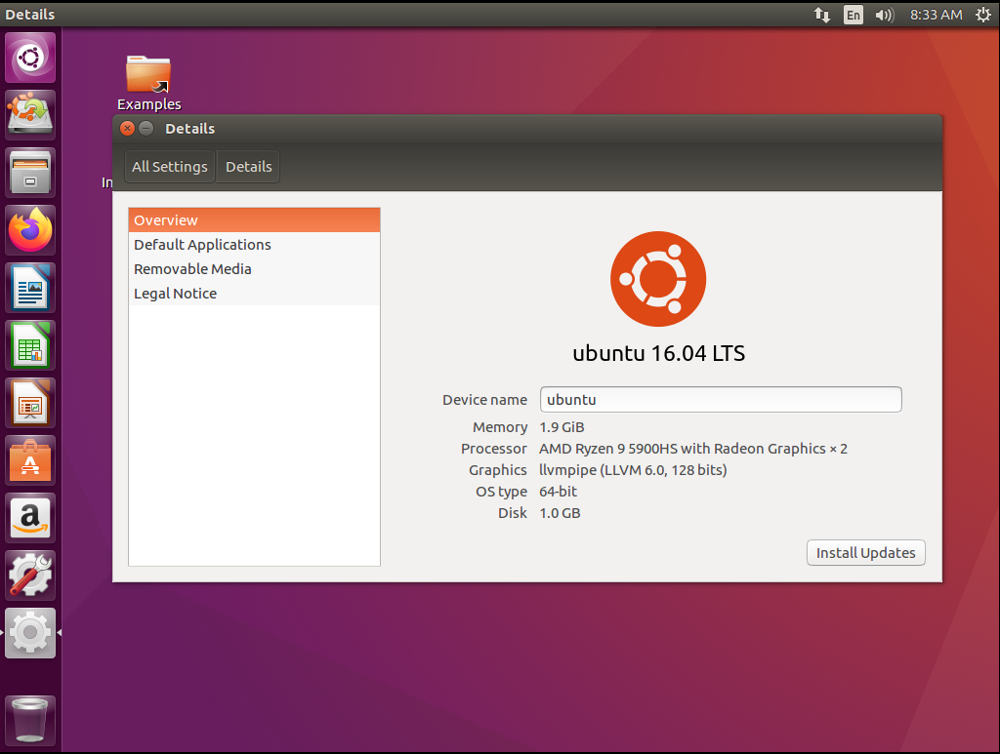{width=640px}

## windows updateしたらOSが 破壊された！

- うぉおおおおおい！

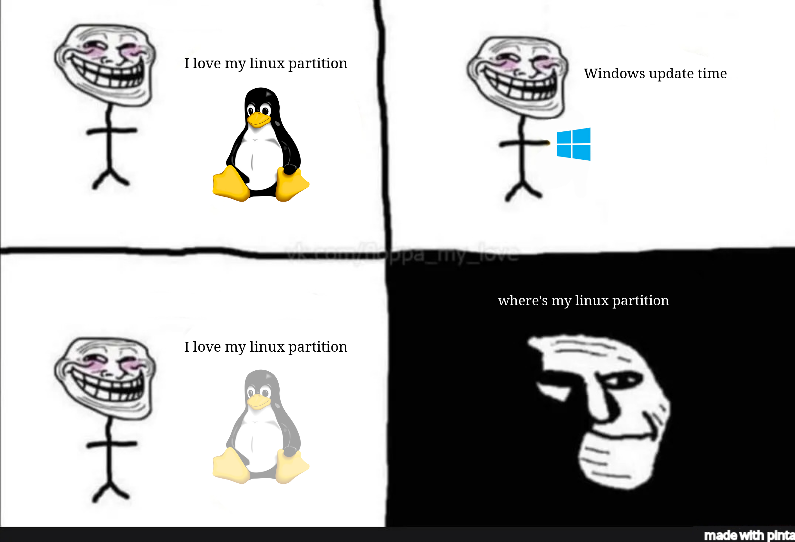{width=640px}

## いっそのこと窓を叩き割ろう!

- windowsを消し去ってUbuntuに完全に移行した
- Ubuntu Budgieを使い始めた
  - デスクトップに美しさを求め始める

|                                            |                                                                       |
| ------------------------------------------ | --------------------------------------------------------------------- |
| 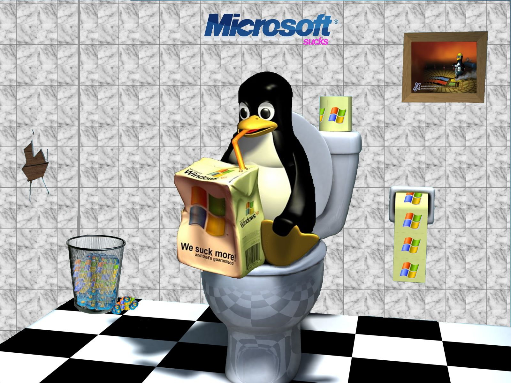{width=640px} | 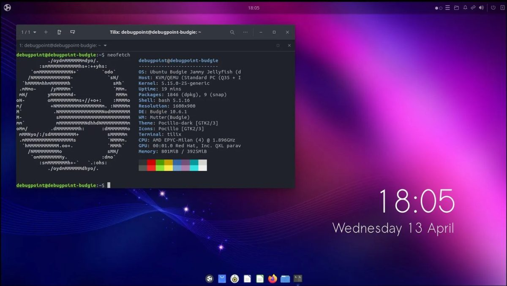{width=640px} |

## 案外困らないUbuntu生活

- ブラウザはfirefoxやChromeが使える
- Office系もGoogleやLibreOfficeで代用可能
- LaTexやmarkdownが素晴らしい (後年)
- ゲームだけ(当時は)厳しかった...

## Ubuntu壊れる...

- `apt update && apt upgrade`でなんか壊れる
- 何がどう壊れたのか知識不足で分からない
- 結局再インスコ...

## ArchLinuxとの出会い

サークルにて...

- 友人: 「i3っていう**タイリングWM**っていいで。 
  **vim**もいいぜ！ 
  **ArchLinux**ってエッチだぜ 
  **unixporn**はエチエチだぜ」
- ワイ: 「はぇー。ええやん」
  - →初めてのArch Linuxインストールバトル開始

## 2週間に及ぶ Arch Linuxインストールバトル

- `gdisk`？ `systemd`？ `useradd`？ ナニソレ？
- xmonadにするかー (Haskellを眺めつつ)
  - 友人と同じi3を使うのは負けた気がする...
- `dotfiles`の整備も併走
- **早急に**インスコしないと外で使える端末がない！

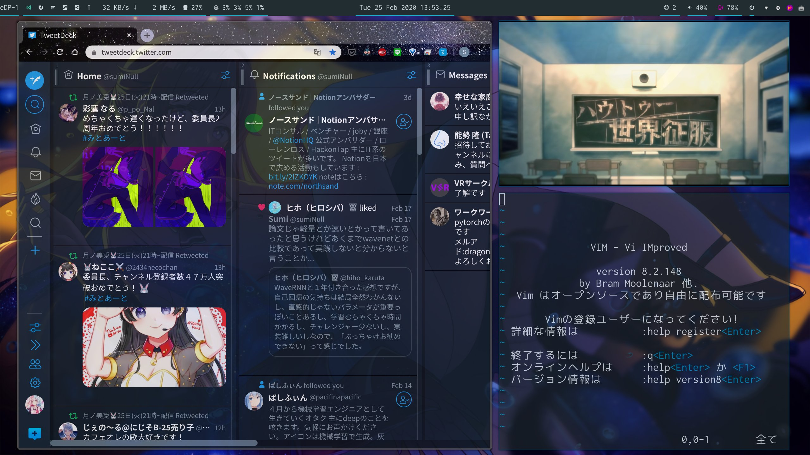{width=560px}

## 素晴らしきArch Linux

- `pacman`(パッケージマネージャ)が優秀
  - `apt`のような重さがない
  - conflictがあれば更新しない
- 公式repo + AURに必要なパッケージが大体揃ってる！
- 壊れてもどこが問題か大体分かる
- **ArchWiki**サイコー！

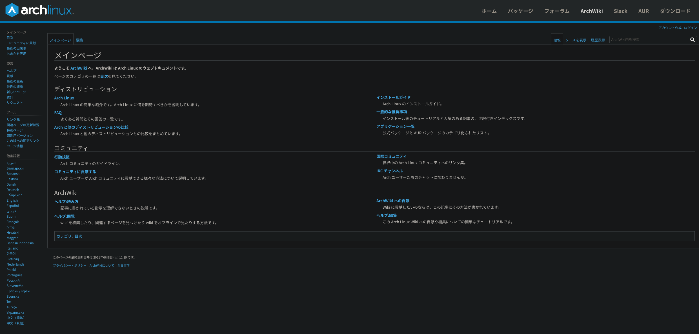{width=720px}

## unixpornという沼

- GNOMEやKDEに負けないエチエチな環境を作りたい！
- キーボードから手を離さないという喜び
  - タイリングWMやVIM、CLIに自然とふれていく

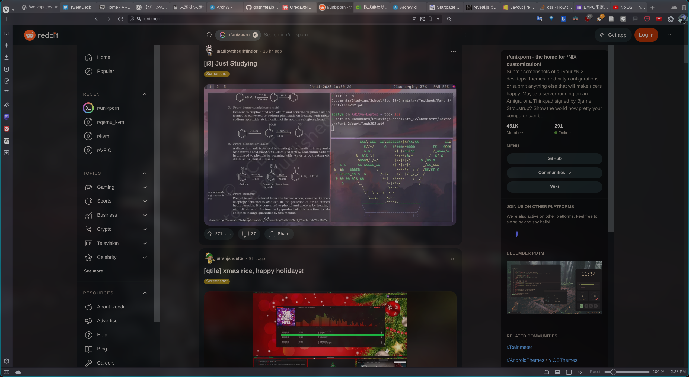{width=720px}

## Arch Linuxもやっぱり壊れる...

- 年に数度深刻な問題で起動ができなくなる...
  - 更新はできるけれど...
- リカバリーディスク起動からのインスコバトル開幕！

## NixOSとの出会い

VRChatにて

- ワイ： 「Archっていいですよね~」
- フレ： 「NixOSだと全部**プログラムで設定**記述できるよー 壊れても**ロールバック**できるよー」
- ワイ： 「はぇー。ええやん。」
  - →NixOSインスコバトル開幕！
    - やっぱりラップトップが血祭りに...

### NixOS

- 関数言語`nix`で全ての設定を記述するDistro
- 古い設定にロールバック可能

## nixはwrapperのwrapper

- app → `systemd` or `XDG` or `boot script` ... → `nix`
- 全てを`nix`で管理することの難しさ
  - FHSの非準拠など特有のクセ
- `*.nix`がビルドできてもシステム設定が正しいかは別
- 凝ったことをしようとするとパッケージビルド などにも詳しくないと..

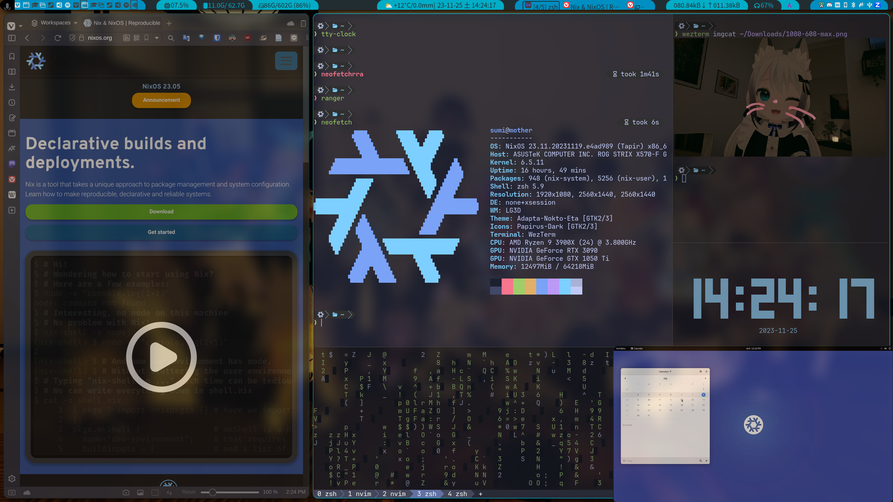{width=640px}

---

結局、Linux使えるようになるには...

## 不満をあったら即解決しよう！

- 不満→勧められて→とりあえずインスコ・実装のサイクル
- Linuxは大体問題が分かるから解決できる→楽しい
  - `journalctl`や各種Log
- 解決できたら一つTuxと仲良しになれる！
  - 自然と必要な知識が得られていく...はず...

|                                                        |                                      |
| ------------------------------------------------------ | ------------------------------------ |
| 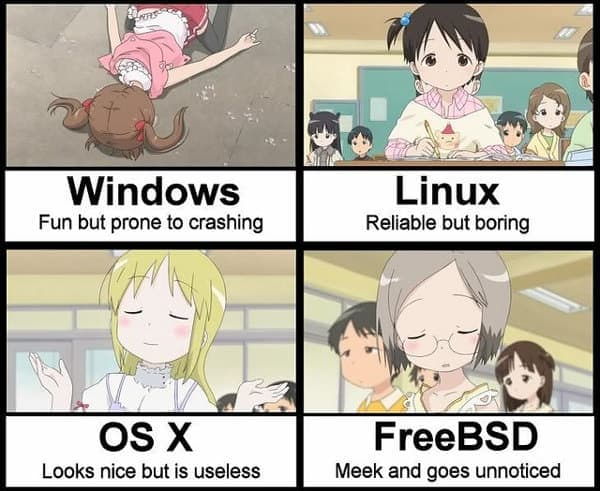{width=480px} | {width=240px} |

## 不満が無いなら...

- 最低限、`cd`, `cp`, `ls`, `mkdir`, `mv`ができれば何とかなる
- あくまでOSも環境・ツールでしかない
  - 環境をどれだけ良くしても進捗は...
- プログラムやアルゴリズムを学んだほうがいい...と思う
- どーしても入門したいなら**Manjaro Linux** (Arch系)がオススメ
  - WSL2はWSL2のクセがあるので...

# 院進で転学・転学科したはなし

## 伝えたいこと

1. 大学院とその周りの立地は実際に現地に行って確かた方がいい
2. 転科する際の院試の勉強は3回生の終わりからした方がいい

## 経歴

| いつ | 地方 |      学科      |        専門        |
| :--: | :--: | :------------: | :----------------: |
| 学部 | 関西 | **応用化学科** |        触媒        |
| 修士 | 東北 |   **情報系**   | 声質変換・音声合成 |

## そもそも...

- 高校時代から`汎用人工知能`に興味があった
  - 対話 (人工無能)や音声合成を実装したくてプログラム始めた
- 高校はいわゆる`自称進学校`で辛かった... (というより無気力症候群になった)
- センター試験と本試験がゴミゴミだった
  - プログラムとかPCにのめり込んでいた
- 繰り下げでギリギリ合格した
  - 「浪人には耐えられないなぁ」っと日和った

## 2回生での転科は？

- 大学には2回生で転科できる制度がある
- 学部・学科によって卒業に必須となる単位は**全然違う**
  - 特に実験とか数学とか (化学では解析がいらなかった )
- 転科すると、1年卒業が延びる
  - 学費面で延びるのはちょっと...
- 院試は大学入試よりは簡単...？

## 院試は大学入試より 簡単という幻想

- 条件付きで簡単...というよりかは`下地`がある
  - 同大学
  - 同学科
  - ちゃんと授業に出ていた (単位を取れていた)
- 転科する場合は`15時間/単位×必要科目分の知識`を自力で学習する必要
  - しかも内容は当然のように高度
- 他大の場合は`圧倒的に情報不足`
  - 教員の出題傾向や面接内容等
- 同大学同学科への進学でも落ちるときは落ちる

## 院試の勉強...

- 開始は4回生になってから
  - 入試は大体7月
- 過去問は取り寄せれば大学院から大体1-2年は貰えた
  - X (Twitter)を駆使して複数年貰った
- 基礎知識は**教科書やYoutube**で得た
  - ちょうどコロナで大学教員がアップしている高品質の動画が多数あった
- 分からないところはサークル内の別学科の友人に聞いた

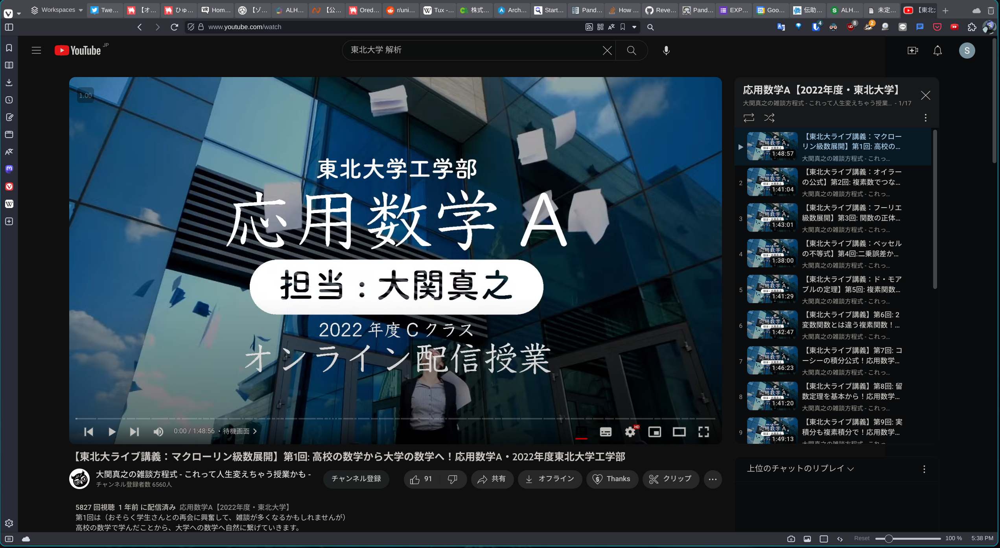{width=480px}

## 志望先の選定

- 複数の志望先
  - リスクの軽減とどうしても情報系に進みたかった
- 繋がりのあった教授と交流のある研究室をいくつか紹介してもらった
  - 東北の中で2つ紹介してもらった (計3つ受けることに)
    - 面接して受け入れていただけるかも確認した
- 地域と人間関係の構築は特に懸念してなかった
  - 住めば大体どこも同じだろう
  - 人間関係は最悪VRChatがあるだろう

## 試験当日行ってビックリ (Part 1) 多分住めない...

- 県庁所在地でこれか...不安が募る
  - 関西の主要都市は全国的に見てデカいということを失念
- 大学のあるところ
  - 駅前に何もない
  - 歩いても何もない (スーパーどこ...)
- 試験の出来も良くなかった

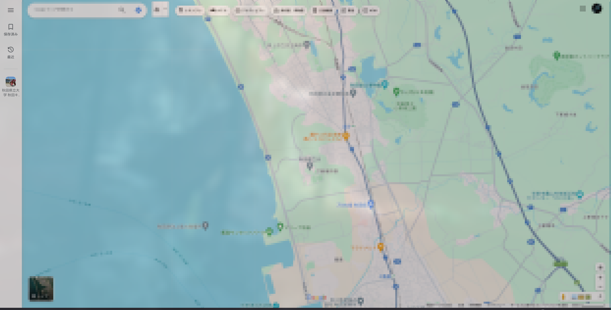{width=560px}

## 試験当日行ってビックリ (Part 2) ドナドナ...

- 深夜、雨模様の駅前、シャッター街...
  - 前日の試験の出来も引きづっていた
- 神社で賽銭のために銭を投げたら外した
  - しかも2つ目の社で...
- 試験の出来...
  - 面接で受け入れ先の教員の前で「分かりません」を連呼した

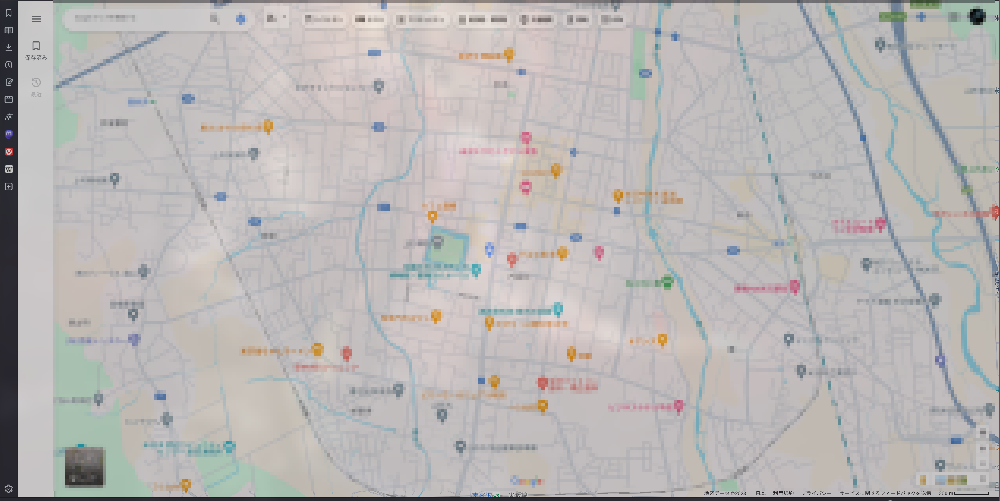{width=560px}

## そして3つめ

- ここが本命だった
- 初日でやらかす
  - エルミート行列ってなんぞや...
- 失意のうちに帰郷...
  - 二日目はそれなりに解けたと感じていたために...

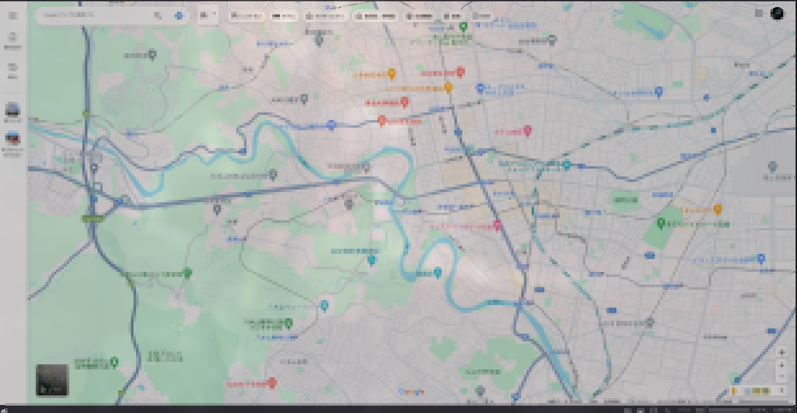{width=640px}

## 合格発表日までの地獄の日々

- `院浪` or `就活`の選択が目前に迫っていた
- 後期日程で受けられるところには手辺り次第コンタクトを取った
- 合格発表日までの2週間は本当に鬱だった
  - 家族共々、まるで深海の中で生活しているかのような圧迫感

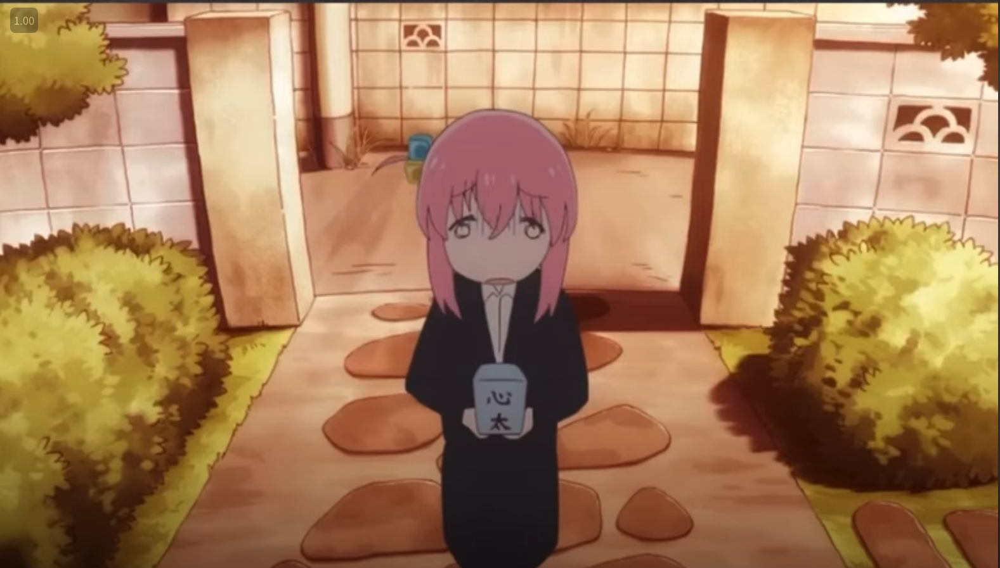{width=640px}

## そして...

<h1 class="r-fit-text">2つ目合格！！</h1>

後はダメだったけれど...

深海生活からの脱却...

## 振り返って

- 希望の学科に行けてよかったー！
- 諸所にコンタクトを取って情報収集をしていたことは良かった
  - 特に大学院の選定について
- もっと`院試の勉強は早くするべき`だった
  - 3ヶ月前からやっていたが3回生の終わりごろから基礎知識は勉強すべきだった
  - 時間が少なく過去問を中心にしていたが、カリキュラムを網羅的にやる必要があった
- 大学院とその付近の立地は一度`ちゃんと目で見に行くべき`だった
  - 本命以外はgoogle mapで上空から見ただけだった
  - 新幹線の偉大さ
- 家族に深海生活させて本当に申しわけない...
