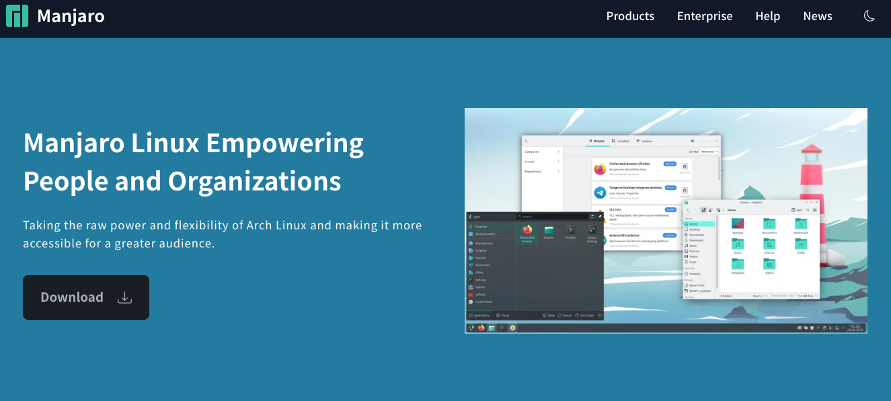
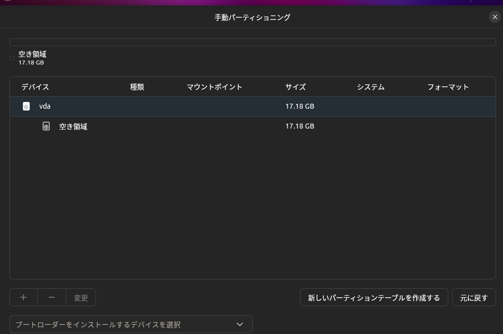
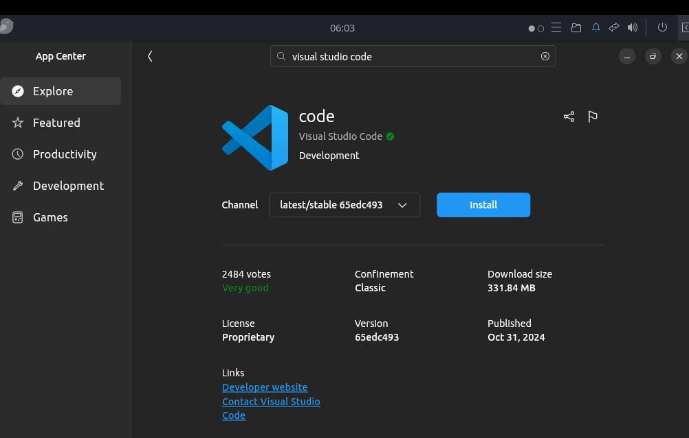

## {background-image="assets/my_avator.jpg" background-position="90%" background-size=35%}

:::::::::::::: {.columns}
::: {.column width="65%"}

### 自己紹介

|      |                                  |
| ---- | -------------------------------- |
| 名前 | Sumi-Sumi <br> (X: @SumiSumiVRC) |
| 仕事 | しがない大学院生                 |
| 専門 | 声質変換・音声合成               |
| 最近 | 2日前に<br>国際学会で発表した!   |

:::
::: {.column width="30%"}

:::
::::::::::::::

## 天気見てなくてすいませんでした...

## 対象

- 機械学習をする学生
- 他分野はよく知りません
  - 少なくとも化学の実験系はあまり関係ない

## 伝えたいこと

- Linuxを普段使いしよう！
  - 研究配属されてから使っているようじゃ遅い...
- 研究ツールとして使うだけなら決して難しくない！
  - windowsを消し飛ばす必要も無い
- 浮いた時間でたくさん議論をしよう！

## Linuxを普段使いしよう！

- 1年間を通じて最もお世話になる研究ツール

  - 実験環境
  - データの収集・加工

- windowsとは異なる使用感
- 使い続けないと何も分からない
  - 問題解決のための検索ワード
  - LLMの応答の真偽判定

## 準備

- 必要なもの
  - 手持ちのwindows PC
  - USBメモリー
  - **USB SSD** (推奨: 256GB以上)
- 必要ないもの

  - パーティション分割
  - Linuxおじさんの戯言
    - ex. ArchLinux, NixOSはいいゾ🙄

## 数ステップで始めるLinux

1. ディストリビューションを選ぶ
2. 好みのフレーバーを選ぶ
3. LiveUSBを作る
4. USB SSDにインストール&ブート
5. 必要なパッケージのインストール

## ディストリビューションを選ぶ

:::::::::::::: {.columns}
::: {.column width="50%"}

### Ubuntu

- ユーザーフレンドリー
- 日本語情報が多数


:::
::: {.column width="50%"}

### Manjaro

- `pacman` is all you need
- 最強のWiki, ArchWiki



:::
::::::::::::::

## 好みの見た目を選ぶ

:::::::::::::: {.columns}
::: {.column width="50%"}

### Ubuntu

{widthh="80%"}

:::
::: {.column width="50%"}

### Manjaro


:::
::::::::::::::

## LiveUSBを作る

- Ventoy
  - 複数isoを一本で
  - exeで簡単にboot USBを作成可能
  - USBにisoをドラッグ&ドロップするだけで完成!

{width="50%"}

## USB SSDにインストール&ブート

- 指示に従ってﾎﾟﾁﾎﾟﾁするだけ
  - 誤ってUSB SSD以外に入れないように

:::::::::::::: {.columns}
::: {.column width="50%"}


:::
::: {.column width="50%"}



:::
::::::::::::::

## 必要なパッケージのインストール

- MS office以外は大抵ある
- windowsとほぼ同じ使用感

:::::::::::::: {.columns}
::: {.column width="50%"}

- GUIから
  

:::
::: {.column width="50%"}

- ターミナルから（推奨）

  - できれば慣れた方が良い

  

:::
::::::::::::::

## 終わり！

- vimもコンテナも(最初は)必要ない
- コマンドやスクリプトは使いながら覚えればいい

{width="50%"}

## そもそも

## 大学とは？

{width=40%}

---

> 大学は、学術の中心として深く真理を探求し専門の学芸を教授研究し、知的、道徳的及び応用的能力を展開させることを本質とするものであり、その活動を十全に保障するため、伝統的に一定の自主性・自律性が承認されていることが基本的な特質である。
> <small>文部科学省 大学分科会制度部会での審議の中間的な整理 より</small>

- 大学の「第三の使命」として**社会貢献**
- 専門学校は**実践的な職業教育**・専門技術教育機関として対比

---

## 大学では...

1. 広い知識を身に付け
2. 専門領域を深め
3. 研究して
4. 成果を社会に還元する

一方で...

- 卒研の1年間でどこまでできるのか...

---

## いきなり社会と言われても...

- 世間≠社会
  - 社会貢献：地域社会・経済社会・国際社会等<br>広い意味での社会全体の発展への寄与
- 研究室も一つの社会と言えるのでは？

<!-- ## 時間が足りない！ -->

<!-- ```mermaid -->
<!-- gantt -->
<!--     title とある院生の一日 (M1, 前期) -->
<!--     dateFormat HH:mm -->
<!--     axisFormat %H:%M -->
<!--     活動開始 : milestone, m1, 10:00, 2m -->
<!--     ゼミ : 90m -->
<!--     昼食 : 60m -->
<!--     授業 : 90m -->
<!--     授業 : 90m -->
<!--     TA : 60m -->
<!--     文献調査 : 60m -->
<!--     実験コード作成 : 80m -->
<!--     帰宅 : milestone, m2, 19:00, 2m -->
<!-- ``` -->

<!-- --- -->

## できた=成果ではない

- ネガティブな結果もまた成果(by どこかの先生)
  - 後発への指針

{width=20%}

## 時間も足りない！

- Linuxとかシェルで躓いている暇は無い


## 人に何かを聞くということは...

- 他人の時間を自分のために使ってくれている
- できれば双方に何か益があるとうれしい
  - 考えても分からないことに時間を使いたい...たくない?

## ご清聴ありがとうございました

- 早いうちにLinuxに慣れよう！
- 浮いた時間で研究しよう！
